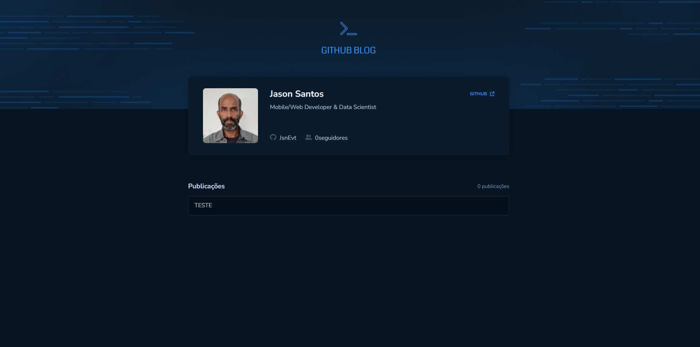

<p align="center">
  
  
  <a href="https://github.com/jsnevt/README-github_blog/commits/master">
    
  </a>
    
   
   
  <a href="https://rocketseat.com.br">
    
  </a>
  
  <a href="https://blog.rocketseat.com.br/">
    
    </a>
</p>

<h1 align="center">
    
</h1>

<h4 align="center"> 
	🚧  Github Blog -  Concluído 🚀 🚧
</h4>

<p align="center">
 <a href="#-sobre-o-projeto">Sobre</a> •
 <a href="#-funcionalidades">Funcionalidades</a> •
 <a href="#-layout">Layout</a> • 
 <a href="#-como-executar-o-projeto">Como executar</a> • 
 <a href="#-tecnologias">Tecnologias</a> • 
 <a href="#-contribuidores">Contribuidores</a> • 
 <a href="#-autor">Autor</a> • 
 <a href="#user-content--licença">Licença</a>
</p>

## 💻 Sobre o projeto

Github Blog é uma aplicação que utiliza a API do GitHub para buscar issues de um repositório, dados do perfil e exibir elas em um blog.

Projeto frontend desenvolvido durante o curso online oferecido pela [Rocketseat].

---

## ⚙️ Funcionalidades

- [x] Pessoas podem utilizar esta aplicação para alimentar seu blog capturando as informações do GitHub automaticamente
	- A aplicação faz comunicação com a API do GitHub para capturar as informações do repositório, dados do perfil e alimentar o blog do usuário.

---

## 🎨 Layout

O layout da aplicação está disponível no Figma:

<a href="https://www.figma.com/file/4ULVMn2Y700bsvNwymRb1i/GitHub-Blog-(Community)?type=design&mode=design&t=gK6GdbKRVRSLoyAK-0">
  
</a>


### Web

<p align="center" style="display: flex; align-items: flex-start; justify-content: center;">
  

</p>

---

## 🚀 Como executar o projeto

O projeto foi feito usando o framework Vite com React 


### Pré-requisitos

Antes de começar, você vai precisar ter instalado em sua máquina as seguintes ferramentas:
[Git](https://git-scm.com), 
[Node.js](https://nodejs.org/en/). 
Além disto é bom ter um editor para trabalhar com o código como [VSCode](https://code.visualstudio.com/)


#### 🧭 Rodando a aplicação web (Frontend)

```bash

# No prompt de comando:
# Crie uma pasta onde desejar
# Acesse a pasta e no terminal

# Clone este repositório
$ git clone https://github.com/jsnevt/github_blog.git

# No VSCode, abra a pasta onde o arquivo foi clonado e abra o projeto

# Dentro do terminal do VS Code, instale as dependências
$ npm i

# Acesse o terminal do VS e execute a aplicação em modo desenvolvimento
$ Digite "num run dev" (sem as aspas)

A aplicação será aberta - acesse http://localhost:5173

```
---

## 🛠 Tecnologias

As seguintes ferramentas foram usadas na construção do projeto:

#### **Website**  ([React](https://reactjs.org/)  +  [TypeScript](https://www.typescriptlang.org/))

-   **[React](https://github.com/facebook/react)**
-   **[React-hook-form](https://github.com/react-hook-form/resolvers)**
-   **[React-markdown](https://github.com/remarkjs/react-markdown)**
-   **[Styled-components](https://github.com/styled-components/styled-components)**
-   **[Typescript](https://github.com/microsoft/TypeScript)**
-   **[Vite](https://github.com/vitejs/vite)**
-   **[Moment](https://github.com/moment/moment)**
-   **[API Github](https://github.com/public-apis/public-apis)**

> Veja o arquivo  [package.json](https://github.com/JsnEvt/coffeedelivery/blob/main/package.json)

## 👨‍💻 Contribuidores

💜 Sinceros agradecimentos a essa galera espetacular, quem contribuem para melhorar a vida das pessoas e o mundo!!!  👏  :)

<table>
  <tr>
    <td align="center"><a href="https://rocketseat.com.br"><br /><sub><b>Diego Fernandes</b></sub></a><br /><a href="https://rocketseat.com.br/" title="Rocketseat">👨‍🚀</a></td>
    <td align="center"><a href="https://rocketseat.com.br"><br /><sub><b>Cleiton Souza</b></sub></a><br /><a href="https://rocketseat.com.br/" title="Rocketseat">👨‍🚀</a></td>
    <td align="center"><a href="https://rocketseat.com.br"><br /><sub><b>Robson Marques</b></sub></a><br /><a href="https://rocketseat.com.br/" title="Rocketseat">👨‍🚀</a></td>
    <td align="center"><a href="https://rocketseat.com.br"><br /><sub><b>Claudio Orlandi</b></sub></a><br /><a href="https://rocketseat.com.br/" title="Rocketseat">🚀</a></td>
    <td align="center"><a href="https://rocketseat.com.br"><br /><sub><b>Vinícios Fraga</b></sub></a><br /><a href="https://rocketseat.com.br/" title="Rocketseat">🚀</a></td>
    <td align="center"><a href="https://rocketseat.com.br"><br /><sub><b>Hugo Duarte</b></sub></a><br /><a href="https://rocketseat.com.br/" title="Rocketseat">🚀</a>  <a href="https://blog.rocketseat.com.br/" title="Blog">🌐</a></td>
    
  </tr>
  <tr>
    <td align="center"><a href="https://rocketseat.com.br"><br /><sub><b>Joseph Oliveira</b></sub></a><br /><a href="https://rocketseat.com.br/" title="Rocketseat">🚀</a></td>
    <td align="center"><a href="https://rocketseat.com.br"><br /><sub><b>Guilherme Rodz</b></sub></a><br /><a href="https://rocketseat.com.br/" title="Rocketseat">🚀</a></td>
    <td align="center"><a href="https://rocketseat.com.br"><br /><sub><b>Mayk Brito</b></sub></a><br /><a href="https://rocketseat.com.br/" title="Rocketseat">🚀</a></td>
    <td align="center"><a href="https://rocketseat.com.br"><br /><sub><b>João Paulo</b></sub></a><br /><a href="https://rocketseat.com.br/" title="Rocketseat">🚀</a></td>
    <td align="center"><a href="https://rocketseat.com.br"><br /><sub><b>Luke Morales</b></sub></a><br /><a href="https://rocketseat.com.br/" title="Rocketseat">🚀</a></td>
     <td align="center"><a href="https://rocketseat.com.br"><br /><sub><b>Luiz Batanero</b></sub></a><br /><a href="https://rocketseat.com.br/" title="Rocketseat">🚀</a></td>
    
  </tr>
</table>


## 💪 Como contribuir para o projeto

1. Faça um **fork** do projeto.
2. Crie uma nova branch com as suas alterações: `git checkout -b my-feature`
3. Salve as alterações e crie uma mensagem de commit contando o que você fez: `git commit -m "feature: My new feature"`
4. Envie as suas alterações: `git push origin my-feature`
> Caso tenha alguma dúvida confira este [guia de como contribuir no GitHub](./CONTRIBUTING.md)

---

## 🦸 Autor

[](https://www.linkedin.com/in/jason-everton-041226223/)

[](mailto:jasonemsw10@gmail.com)


## 📝 Licença

Este projeto esta sobe a licença [MIT](./LICENSE).

Feito com ❤️ por Jason Everton 👋🏽 [Entre em contato!](https://www.linkedin.com/in/jason-everton-041226223/)

---
